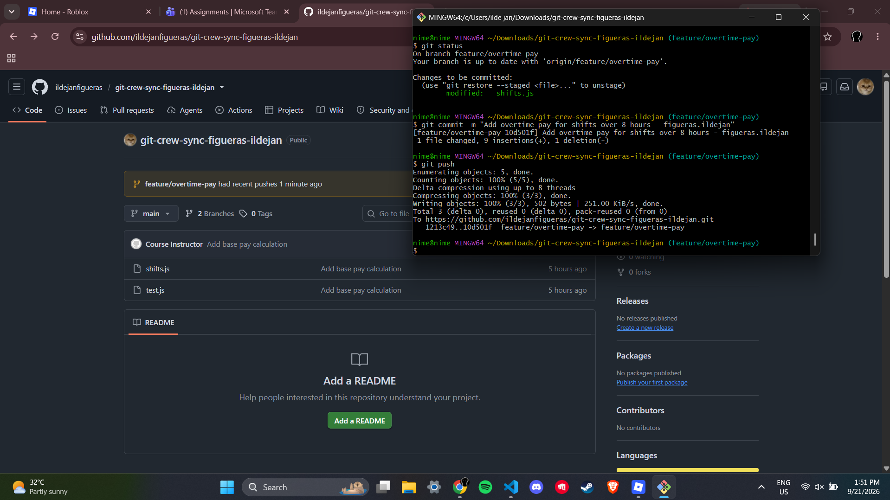
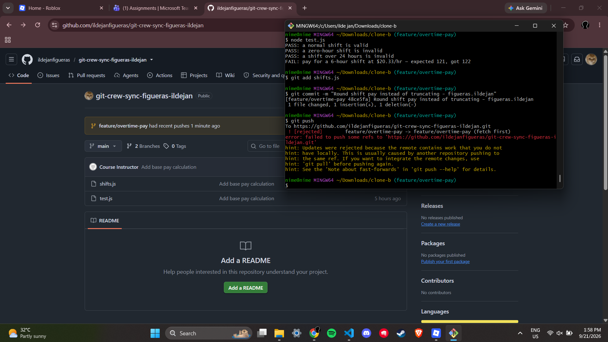
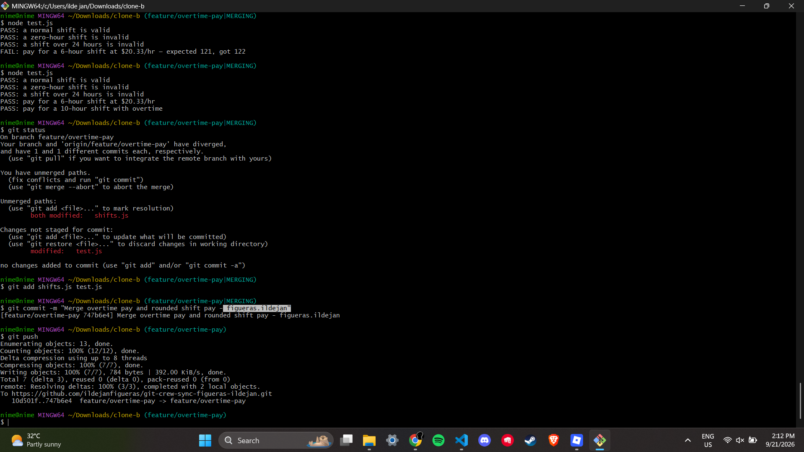
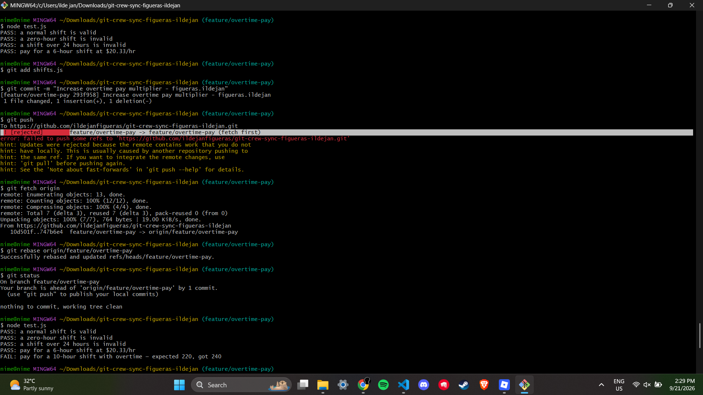
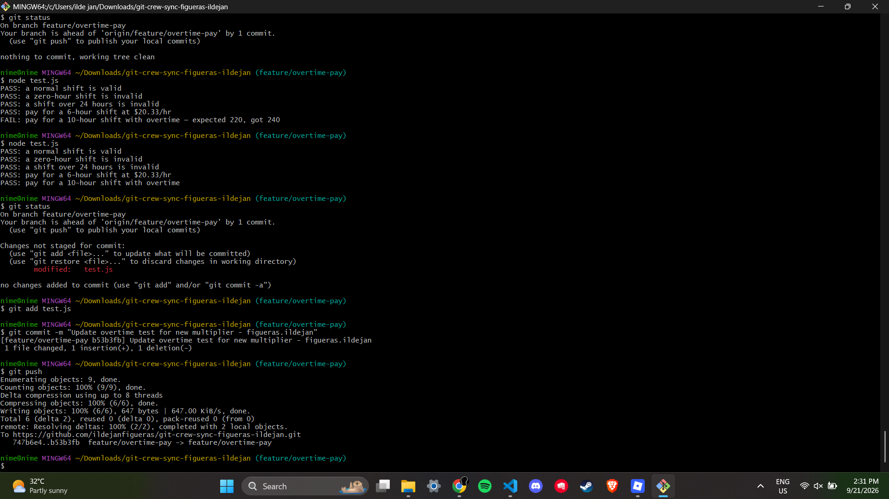
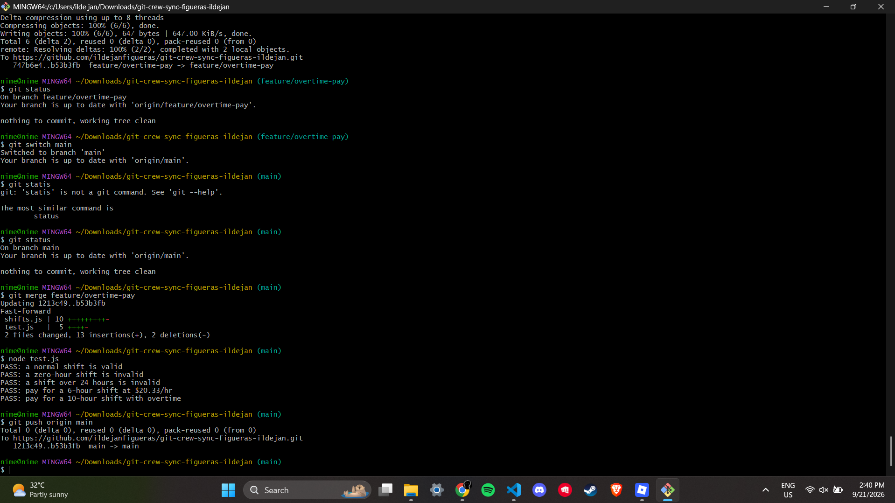
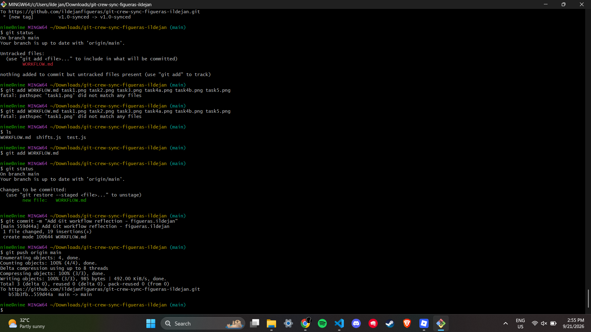

# Git Workflow Documentation

## Task 1: Add Overtime Pay

Added overtime pay calculation for shifts over 8 hours.

---

## Task 2: Round Shift Pay

Changed the pay calculation to use rounding instead of truncating the result.

---

## Task 3: Resolve Merge Conflict

Fetched the latest changes, merged the branches, resolved the conflict, and made sure all tests passed.

---

## Task 4: Reconcile with Rebase

Rebased the local branch with the latest remote changes and updated the overtime test.

---

## Task 5: Merge Feature into Main

Merged the completed feature branch into main and verified that all tests passed.

---

## Task 6: Finalize and Tag

Finalized the workflow, added the documentation and screenshots, and tagged the final synced version.

---

# Questions/Reflections

### 1. What caused the rejected push error?

The push was rejected because the remote branch had changes that were not yet in my local branch. Another clone had already pushed changes, so my local branch was behind. Git rejected the push to prevent me from accidentally overwriting the remote changes.

### 2. How did Task 3 and Task 4 differ?

In Task 3, I used `git fetch` and `git merge` to combine the remote and local changes. This created a merge history after resolving the conflict. In Task 4, I used `git fetch` and `git rebase` to place my local changes on top of the updated remote branch, which kept the history more linear.

### 3. What habit could help avoid rejected pushes?

A good habit is to check or fetch the latest changes from the remote repository before starting new work or pushing changes. This helps make sure my local branch is updated.

### 4. Would you use merge or rebase by default on a shared team branch? Why?

I would use merge by default on a shared team branch because it keeps the existing commit history and does not rewrite commits that other team members may already have. Rebase can still be useful on a personal feature branch when a cleaner history is needed.
